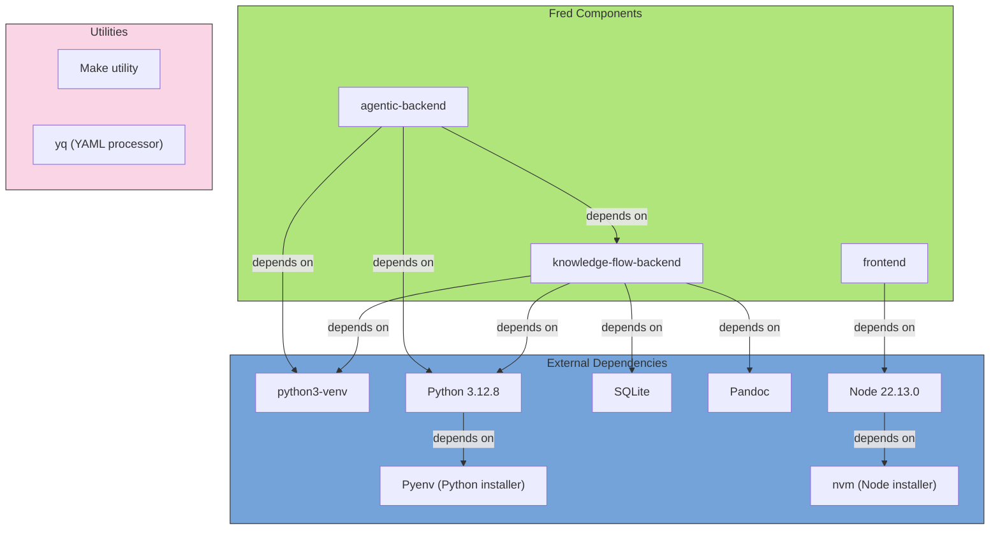

# Fred

[Who does what](https://github.com/orgs/ThalesGroup/projects/8/views/4)

Fred is both:

- An innovation lab — helping developers rapidly explore agentic patterns, domain-specific logic, and custom tools.
- A production-ready platform — already integrated with real enterprise constraints: auth, security, document lifecycle, and deployment best practices.

It is composed of:

- a **Python agentic backend** (FastAPI + LangGraph)
- a **Python knowledge flow backend** (FastAPI) for document ingestion and vector search
- a **React frontend**

Fred provides a number of easy examples to start with. These are provided in so-called 'academy' folders for you to play with mcp server or agent development.

Fred is not a development framework, rather a full reference implementation that shows how to build practical multi-agent applications with LangChain and LangGraph. Agents cooperate to answer technical, context-aware questions.

See the project site: <https://fredk8.dev>

Contents:

- [Getting started](#getting-started)
  - [Development environment setup](#development-environment-setup)
    - [Option 1 (recommended): Let the Dev Container do it for you!](#option-1-recommended-let-the-dev-container-do-it-for-you)
    - [Option 2: Native mode i.e. install everything locally](#option-2-native-mode-ie-install-everything-locally)
    - [Advanced developer tips](#advanced-developer-tips)
  - [Model configuration](#model-configuration)
  - [Start Fred components](#start-fred-components)
  - [Head for the Fred UI!](#head-for-the-fred-ui)
- [Production mode](#production-mode)
- [Agent coding academy](#agent-coding-academy)
- [Advanced configuration](#advanced-configuration)
- [Core Architecture and Licensing Clarity](#core-architecture-and-licensing-clarity)
- [Documentation](#documentation)
- [Contributing](#contributing)
- [Community](#community)
- [Contacts](#contacts)

## Getting started

To ensure a smooth first-time experience, Fred’s maintainers designed Dev Container/Native startup to require no additional external components (except, of course, to LLM APIs).

By default, using either Dev Container or native startup:

- Fred stores all data locally using **SQLite** for SQL/metadata and **ChromaDB** for vectors/embeddings. (DuckDB has been deprecated.) Data includes metrics, chat conversations, document uploads, and embeddings.
- Authentication and authorization are mocked.

> **Note:**  
> Accross all setup modes, a common requirement is to have access to Large Language Model (LLM) APIs via a model provider. Supported options include:
>
> - **Public OpenAI APIs:** Connect using your OpenAI API key.
> - **Private Ollama Server:** Host open-source models such as Mistral, Qwen, Gemma, and Phi locally or on a shared server.
> - **Private Azure AI Endpoints:** Connect using your Azure OpenAI key.
>
> Detailed instructions for configuring your chosen model provider are provided [below](#model-configuration).

### Development environment setup

Choose how you want to prepare Fred's development environment:

#### Option 1 (recommended): Let the Dev Container do it for you!

<details>
  <summary>Details</summary>

Prefer an isolated environment with everything pre-installed?

The Dev Container setup takes care of all dependencies related to agentic backend, knowledge-flow backend, and frontend components.

##### Prerequisites

| Tool                                                                | Purpose                             |
| ------------------------------------------------------------------- | ----------------------------------- |
| **Docker** / Docker Desktop                                         | Runs the container                  |
| **VS Code**                                                         | Primary IDE                         |
| **Dev Containers extension** (`ms-vscode-remote.remote-containers`) | Opens the repo inside the container |

##### Open the container

1. Clone (or open) the repository in VS Code.
2. Press <kbd>F1</kbd> → **Dev Containers: Reopen in Container**.

When the terminal prompt appears, the workspace is ready but you still need to run the different services with `make run` as specified in the [next section](#start-fred-components). Ports `8000` (Agentic backend), `8111` (Knowledge Flow backend), and `5173` (Frontend (vite)) are automatically forwarded to the host.

##### Rebuilds & troubleshooting

- Rebuild the container: <kbd>F1</kbd> → _Dev Containers: Rebuild Container_
- Dependencies feel stale? Delete the relevant `.venv` or `frontend/node_modules` inside the container, then rerun the associated `make` target.
- Need to change API keys or models? Update the backend `.env` files inside the container and restart the relevant service. See [Model configuration](#model-configuration) for more details.

</details>

#### Option 2: Native mode i.e. install everything locally

<details>
  <summary>Details</summary>

> Note: Note that this native mode only applies to Unix-based OS (e.g., Mac or Linux-related OS).

##### Prerequisites

<details>
  <summary>First, make sure you have all the requirements installed</summary>

| Tool         | Type                       | Version                                                                                             | Install hint                                                                                |
| ------------ | -------------------------- | --------------------------------------------------------------------------------------------------- | ------------------------------------------------------------------------------------------- |
| Pyenv        | Python installer           | latest                                                                                              | [Pyenv installation instructions](https://github.com/pyenv/pyenv#installation)              |
| Python       | Programming language       | 3.12.8                                                                                              | Use `pyenv install 3.12.8`                                                                  |
| python3-venv | Python venv module/package | matching                                                                                            | Bundled with Python 3 on most systems; otherwise `apt install python3-venv` (Debian/Ubuntu) |
| nvm          | Node installer             | latest                                                                                              | [nvm installation instructions](https://github.com/nvm-sh/nvm#installing-and-updating)      |
| Node.js      | Programming language       | 22.13.0                                                                                             | Use `nvm install 22.13.0`                                                                   |
| Make         | Utility                    | system                                                                                              | Install via system package manager (e.g., `apt install make`, `brew install make`)          |
| yq           | Utility                    | system                                                                                              | Install via system package manager                                                          |
| SQLite       | Local RDBMS engine         | ≥ 3.35.0                                                                                            | Install via system package manager                                                          |
| Pandoc       | 2.9.2.1                    | [Pandoc installation instructions](https://pandoc.org/installing.html)                              | For DOCX document ingestion                                                                 |
| LibreOffice  | Headless doc converter     | [LibreOffice installation instructions](https://www.libreoffice.org/download/download-libreoffice/) | For PPTX conversion into PDF                                                                |

  <details>
    <summary>Dependency details</summary>



  </details>

</details>

##### Clone the repo

```bash
git clone https://github.com/ThalesGroup/fred.git
cd fred
```

</details>

#### Advanced developer tips

> Prerequisites:
>
> - [Visual Studio Code](https://code.visualstudio.com/)
> - VS Code extensions:
>   - **Python** (ms-python.python)
>   - **Pylance** (ms-python.vscode-pylance)

To get full VS Code Python support (linting, IntelliSense, debugging, etc.) across our repo, we provide:

<details>
  <summary>1. A VS Code workspace file `fred.code-workspace` that loads all sub‑projects.</summary>

After cloning the repo, you can open Fred's VS Code workspace with `code .vscode/fred.code-workspace`

When you open Fred's VS Code workspace, VS Code will load four folders:

- `fred` – for any repo‑wide files, scripts, etc
- `agentic-backend` – first Python backend
- `knowledge-flow-backend` – second Python backend
- `fred-core` - a common python library for both python backends
- `frontend` – UI
</details>

<details>
  <summary>2. Per‑folder `.vscode/settings.json` files in each Python backend to pin the interpreter.</summary>

Each backend ships its own virtual environment under .venv. We’ve added a per‑folder VS Code setting (see for instance `agentic_backend/.vscode/settings.json`) to automatically pick it:

This ensures that as soon as you open a Python file under agentic_backend/ (or knowledge_flow_backend/), VS Code will:

- Activate that folder’s virtual environment
- Provide linting, IntelliSense, formatting, and debugging using the correct Python
</details>

### Model configuration

#### Default Chat Models (Agentic Backend)

Within the **agentic backend**, Fred uses **default models** that serve as the primary AI components for agents. These models determine how agents handle both conversational and general AI tasks.

##### Key Concepts

- **Default Chat Model**  
  This is the model used for all conversational tasks within the agentic backend. Every agent relies on this model unless a specific agent configuration overrides it. It includes configurable options such as temperature, retry limits, and request timeouts.

- **Default Language Model**  
  This model is used for non-chat AI tasks. If it is not explicitly defined, the agentic backend automatically falls back to the default chat model. This ensures consistent behavior and prevents runtime errors when a separate language model is not set.

In the agentic-backend configuration these can be set as is:

```yaml
ai:
  default_chat_model:
    # Required in .env:
    # - OPENAI_API_KEY
    provider: "openai"
    name: "gpt-4o"
    settings: {}
  default_language_model:
    # Required in .env:
    # - OPENAI_API_KEY
    provider: "openai"
    name: "gpt-4o"
    settings: {}
```

⚠️ `default_language_model` overrides `default_chat_model` if set.

##### Notes

- Credentials for the chosen model provider (OpenAI, Azure OpenAI, Ollama, etc.) must be provided in the agentic backend’s environment files.
- These default models form the base of all AI capabilities within the agentic backend, and all agents leverage them unless explicitly configured otherwise.
- Updating the default models in the configuration changes the behavior of all agents, so it is a central point for tuning the system.

#### Set it up according to your development environment

No matter which development environment you choose, both backends rely on two pairs of `.env`/`configuration.yaml` files for credentials and model settings:

- Agentic backend: `agentic-backend/config/.env` and `agentic-backend/config/configuration.yaml`
- Knowledge Flow backend: `knowledge-flow-backend/config/.env` and `knowledge-flow-backend/config/configuration.yaml`

1. **Copy the templates (skip if they already exist).**

   ```bash
   cp agentic-backend/config/.env.template agentic-backend/config/.env
   cp knowledge-flow-backend/config/.env.template knowledge-flow-backend/config/.env
   ```

2. **Edit the `.env` files** to set the API keys, base URLs, and deployment names that match your model provider.

3. **Update each backend’s `configuration.yaml`** so the `provider`, `name`, and optional settings align with the same provider. Use the recipes below as a starting point.

<details>
  <summary>OpenAI</summary>

> **Note:** Out of the box, Fred is configured to use OpenAI public APIs with the following models:
>
> - agentic backend: chat model `gpt-4o`
> - knowledge flow backend: chat model `gpt-4o-mini` and embedding model `text-embedding-3-large`
>
> If you plan to use Fred with these OpenAI models, you don't have to perform the `yq` commands below—just make sure the `.env` files contain your key.

- agentic backend configuration

  - Chat model

    ```bash
    yq eval '.ai.default_chat_model.provider = "openai"' -i agentic-backend/config/configuration.yaml
    yq eval '.ai.default_chat_model.name = "<your-openai-model-name>"' -i agentic-backend/config/configuration.yaml
    yq eval 'del(.ai.default_chat_model.settings)' -i agentic-backend/config/configuration.yaml
    ```

- knowledge flow backend configuration

  - Chat model

    ```bash
    yq eval '.chat_model.provider = "openai"' -i knowledge-flow-backend/config/configuration.yaml
    yq eval '.chat_model.name = "<your-openai-model-name>"' -i knowledge-flow-backend/config/configuration.yaml
    yq eval 'del(.chat_model.settings)' -i knowledge-flow-backend/config/configuration.yaml
    ```

  - Embedding model

    ```bash
    yq eval '.embedding_model.provider = "openai"' -i knowledge-flow-backend/config/configuration.yaml
    yq eval '.embedding_model.name = "<your-openai-model-name>"' -i knowledge-flow-backend/config/configuration.yaml
    yq eval 'del(.embedding_model.settings)' -i knowledge-flow-backend/config/configuration.yaml
    ```

- Copy-paste your `OPENAI_API_KEY` value in both `.env` files.

  > ⚠️ An `OPENAI_API_KEY` from a free OpenAI account unfortunately does not work.

</details>

<details>
  <summary>Azure OpenAI</summary>

- agentic backend configuration

  - Chat model

    ```bash
    yq eval '.ai.default_chat_model.provider = "azure-openai"' -i agentic-backend/config/configuration.yaml
    yq eval '.ai.default_chat_model.name = "<your-azure-openai-deployment-name>"' -i agentic-backend/config/configuration.yaml
    yq eval 'del(.ai.default_chat_model.settings)' -i agentic-backend/config/configuration.yaml
    yq eval '.ai.default_chat_model.settings.azure_endpoint = "<your-azure-openai-endpoint>"' -i agentic-backend/config/configuration.yaml
    yq eval '.ai.default_chat_model.settings.azure_openai_api_version = "<your-azure-openai-api-version>"' -i agentic-backend/config/configuration.yaml
    ```

- knowledge flow backend configuration

  - Chat model

    ```bash
    yq eval '.chat_model.provider = "azure-openai"' -i knowledge-flow-backend/config/configuration.yaml
    yq eval '.chat_model.name = "<your-azure-openai-deployment-name>"' -i knowledge-flow-backend/config/configuration.yaml
    yq eval 'del(.chat_model.settings)' -i knowledge-flow-backend/config/configuration.yaml
    yq eval '.chat_model.settings.azure_endpoint = "<your-azure-openai-endpoint>"' -i knowledge-flow-backend/config/configuration.yaml
    yq eval '.chat_model.settings.azure_openai_api_version = "<your-azure-openai-api-version>"' -i knowledge-flow-backend/config/configuration.yaml
    ```

  - Embedding model

    ```bash
    yq eval '.embedding_model.provider = "azure-openai"' -i knowledge-flow-backend/config/configuration.yaml
    yq eval '.embedding_model.name = "<your-azure-openai-deployment-name>"' -i knowledge-flow-backend/config/configuration.yaml
    yq eval 'del(.embedding_model.settings)' -i knowledge-flow-backend/config/configuration.yaml
    yq eval '.embedding_model.settings.azure_endpoint = "<your-azure-openai-endpoint>"' -i knowledge-flow-backend/config/configuration.yaml
    yq eval '.embedding_model.settings.azure_openai_api_version = "<your-azure-openai-api-version>"' -i knowledge-flow-backend/config/configuration.yaml
    ```

  - Vision model

    ```bash
    yq eval '.vision_model.provider = "azure-openai"' -i knowledge_flow_backend/config/configuration.yaml
    yq eval '.vision_model.name = "<your-azure-openai-deployment-name>"' -i knowledge_flow_backend/config/configuration.yaml
    yq eval 'del(.vision_model.settings)' -i knowledge_flow_backend/config/configuration.yaml
    yq eval '.vision_model.settings.azure_endpoint = "<your-azure-openai-endpoint>"' -i knowledge_flow_backend/config/configuration.yaml
    yq eval '.vision_model.settings.azure_openai_api_version = "<your-azure-openai-api-version>"' -i knowledge_flow_backend/config/configuration.yaml
    ```

- Copy-paste your `AZURE_OPENAI_API_KEY` value in both `.env` files.

</details>

<details>
  <summary>Ollama</summary>

- agentic backend configuration

  - Chat model

    ```bash
    yq eval '.ai.default_chat_model.provider = "ollama"' -i agentic-backend/config/configuration.yaml
    yq eval '.ai.default_chat_model.name = "<your-ollama-model-name>"' -i agentic-backend/config/configuration.yaml
    yq eval 'del(.ai.default_chat_model.settings)' -i agentic-backend/config/configuration.yaml
    yq eval '.ai.default_chat_model.settings.base_url = "<your-ollama-endpoint>"' -i agentic-backend/config/configuration.yaml
    ```

- knowledge flow backend configuration

  - Chat model

    ```bash
    yq eval '.chat_model.provider = "ollama"' -i knowledge-flow-backend/config/configuration.yaml
    yq eval '.chat_model.name = "<your-ollama-model-name>"' -i knowledge-flow-backend/config/configuration.yaml
    yq eval 'del(.chat_model.settings)' -i knowledge-flow-backend/config/configuration.yaml
    yq eval '.chat_model.settings.base_url = "<your-ollama-endpoint>"' -i knowledge-flow-backend/config/configuration.yaml
    ```

  - Embedding model

    ```bash
    yq eval '.embedding_model.provider = "ollama"' -i knowledge-flow-backend/config/configuration.yaml
    yq eval '.embedding_model.name = "<your-ollama-model-name>"' -i knowledge-flow-backend/config/configuration.yaml
    yq eval 'del(.embedding_model.settings)' -i knowledge-flow-backend/config/configuration.yaml
    yq eval '.embedding_model.settings.base_url = "<your-ollama-endpoint>"' -i knowledge-flow-backend/config/configuration.yaml
    ```

</details>

<details>
  <summary>Azure OpenAI via Azure APIM</summary>

- agentic backend configuration

  - Chat model

    ```bash
    yq eval '.ai.default_chat_model.provider = "azure-apim"' -i agentic-backend/config/configuration.yaml
    yq eval '.ai.default_chat_model.name = "<your-azure-openai-deployment-name>"' -i agentic-backend/config/configuration.yaml
    yq eval 'del(.ai.default_chat_model.settings)' -i agentic-backend/config/configuration.yaml
    yq eval '.ai.default_chat_model.settings.azure_ad_client_id = "<your-azure-apim-client-id>"' -i agentic-backend/config/configuration.yaml
    yq eval '.ai.default_chat_model.settings.azure_ad_client_scope = "<your-azure-apim-client-scope>"' -i agentic-backend/config/configuration.yaml
    yq eval '.ai.default_chat_model.settings.azure_apim_base_url = "<your-azure-apim-endpoint>"' -i agentic-backend/config/configuration.yaml
    yq eval '.ai.default_chat_model.settings.azure_apim_resource_path = "<your-azure-apim-resource-path>"' -i agentic-backend/config/configuration.yaml
    yq eval '.ai.default_chat_model.settings.azure_openai_api_version = "<your-azure-openai-api-version>"' -i agentic-backend/config/configuration.yaml
    yq eval '.ai.default_chat_model.settings.azure_tenant_id = "<your-azure-tenant-id>"' -i agentic-backend/config/configuration.yaml
    ```

- knowledge flow backend configuration

  - Chat model

    ```bash
    yq eval '.chat_model.provider = "azure-apim"' -i knowledge-flow-backend/config/configuration.yaml
    yq eval '.chat_model.name = "<your-azure-openai-deployment-name>"' -i knowledge-flow-backend/config/configuration.yaml
    yq eval 'del(.chat_model.settings)' -i knowledge-flow-backend/config/configuration.yaml
    yq eval '.chat_model.settings.azure_ad_client_id = "<your-azure-apim-client-id>"' -i knowledge-flow-backend/config/configuration.yaml
    yq eval '.chat_model.settings.azure_ad_client_scope = "<your-azure-apim-client-scope>"' -i knowledge-flow-backend/config/configuration.yaml
    yq eval '.chat_model.settings.azure_apim_base_url = "<your-azure-apim-endpoint>"' -i knowledge-flow-backend/config/configuration.yaml
    yq eval '.chat_model.settings.azure_apim_resource_path = "<your-azure-apim-resource-path>"' -i knowledge-flow-backend/config/configuration.yaml
    yq eval '.chat_model.settings.azure_openai_api_version = "<your-azure-openai-api-version>"' -i knowledge-flow-backend/config/configuration.yaml
    yq eval '.chat_model.settings.azure_tenant_id = "<your-azure-tenant-id>"' -i knowledge-flow-backend/config/configuration.yaml
    ```

  - Embedding model

    ```bash
    yq eval '.embedding_model.provider = "azure-apim"' -i knowledge-flow-backend/config/configuration.yaml
    yq eval '.embedding_model.name = "<your-azure-openai-deployment-name>"' -i knowledge-flow-backend/config/configuration.yaml
    yq eval 'del(.embedding_model.settings)' -i knowledge-flow-backend/config/configuration.yaml
    yq eval '.embedding_model.settings.azure_ad_client_id = "<your-azure-apim-client-id>"' -i knowledge-flow-backend/config/configuration.yaml
    yq eval '.embedding_model.settings.azure_ad_client_scope = "<your-azure-apim-client-scope>"' -i knowledge-flow-backend/config/configuration.yaml
    yq eval '.embedding_model.settings.azure_apim_base_url = "<your-azure-apim-endpoint>"' -i knowledge-flow-backend/config/configuration.yaml
    yq eval '.embedding_model.settings.azure_apim_resource_path = "<your-azure-apim-resource-path>"' -i knowledge-flow-backend/config/configuration.yaml
    yq eval '.embedding_model.settings.azure_openai_api_version = "<your-azure-openai-api-version>"' -i knowledge-flow-backend/config/configuration.yaml
    yq eval '.embedding_model.settings.azure_tenant_id = "<your-azure-tenant-id>"' -i knowledge-flow-backend/config/configuration.yaml
    ```

- Copy-paste your `AZURE_AD_CLIENT_SECRET` and `AZURE_APIM_SUBSCRIPTION_KEY` values in both `.env` files.

</details>

### Start Fred components

```bash
# knowledge-flow backend
cd knowledge-flow-backend && make run
```

```bash
# agentic backend
cd agentic_backend && make run
```

```bash
# frontend
cd frontend && make run
```

### Head for the Fred UI!

Open <http://localhost:5173> in your browser.

## Production mode

For production deployments (Kubernetes, VMs, on-prem or cloud), refer to:

- [`docs/DEPLOYMENT_GUIDE.md`](./docs/DEPLOYMENT_GUIDE.md) – high-level deployment guide (components, configuration, external dependencies).
- [`docs/DEPLOYMENT_GUIDE_OPENSEARCH.md`](./docs/DEPLOYMENT_GUIDE_OPENSEARCH.md) – OpenSearch-specific requirements. Use this only if you choose OpenSearch over the new PostgreSQL/pgvector option.

The rest of this `README.md` focuses on local developer setup and model configuration.

## Agent coding academy

Refer to the sample third-party applications in [academy samples](./academy/README.md).
Refer to the [academy agents](./agentic-backend/agentic_backend/academy/ACADEMY.md) for a number of sample agents.

## Advanced configuration

### System Architecture

| Component              | Location                   | Role                                                                  |
| ---------------------- | -------------------------- | --------------------------------------------------------------------- |
| Frontend UI            | `./frontend`               | React-based chatbot                                                   |
| Agentic backend        | `./agentic-backend`        | Multi-agent API server                                                |
| Knowledge Flow backend | `./knowledge-flow-backend` | **Optional** knowledge management component (document ingestion & Co) |

### Configuration Files

| File                                               | Purpose                                                 | Tip                                                                 |
| -------------------------------------------------- | ------------------------------------------------------- | ------------------------------------------------------------------- |
| `agentic-backend/config/.env`                      | Secrets (API keys, passwords). Not committed to Git.    | Copy `.env.template` to `.env` and then fill in any missing values. |
| `knowledge-flow-backend/config/.env`               | Same as above                                           | Same as above                                                       |
| `agentic-backend/config/configuration.yaml`        | Functional settings (providers, agents, feature flags). | -                                                                   |
| `knowledge-flow-backend/config/configuration.yaml` | Same as above                                           | -                                                                   |

### Supported Model Providers

| Provider                    | How to enable                                                                                                |
| --------------------------- | ------------------------------------------------------------------------------------------------------------ |
| OpenAI (default)            | Add `OPENAI_API_KEY` to `config/.env`; Adjust `configuration.yaml`                                           |
| Azure OpenAI                | Add `AZURE_OPENAI_API_KEY` to `config/.env`; Adjust `configuration.yaml`                                     |
| Azure OpenAI via Azure APIM | Add `AZURE_APIM_SUBSCRIPTION_KEY` and `AZURE_AD_CLIENT_SECRET` to `config/.env`; Adjust `configuration.yaml` |
| Ollama (local models)       | Adjust `configuration.yaml`                                                                                  |

See `agentic-backend/config/configuration.yaml` (section `ai:`) and `knowledge-flow-backend/config/configuration.yaml` (sections `chat_model:` and `embedding_model:`) for concrete examples.

### Advanced Integrations

- Enable Keycloak or another OIDC provider for authentication
- Persistence options:
  - **Laptop / dev (default):** SQLite for metadata + ChromaDB for vectors (embedded, no external services)
  - **Production:** PostgreSQL + pgvector for metadata/vectors, and optionally MinIO/S3 + OpenSearch if you prefer that stack

## Core Architecture and Licensing Clarity

The three components just described form the _entirety of the Fred platform_. By default they run self-contained on a laptop using **SQLite + ChromaDB** (no external services).

Fred is modular: you can optionally add Keycloak/OpenFGA, MinIO/S3, OpenSearch, and PostgreSQL/pgvector for production-grade persistence.

Persistence options:

- **Dev/laptop (default):** SQLite for all SQL stores, ChromaDB for vectors, local filesystem for blobs.
- **Production (recommended):** PostgreSQL + pgvector for SQL + vectors; optionally pair with MinIO/S3 + OpenSearch if you prefer that stack.

## Documentation

- Generic information

  - [Main docs](https://fredk8.dev/docs)
  - [Features overview](./docs/FEATURES.md)

- Agentic backend

  - [Agentic backend README](./agentic-backend/README.md)
  - [Agentic Architecture](./agentic-backend/docs/RUNTIME_ARCHITECTURE.md)
  - [Agentic backend agentic design](./agentic-backend/docs/AGENTS.md)
  - [MCP capabilities for agent](./agentic-backend/docs/MCP.md)

- Knowledge Flow backend

  - [Knowledge Flow backend README](./knowledge_flow_backend/README.md)

- Frontend

  - [Frontend README](./frontend/README.md)

- Security-related topics

  - [Security overview](./docs/SECURITY.md)
  - [Keycloak](./docs/KEYCLOAK.md)

- Developer and contributors guides

  - [Developer Tools](./developer_tools/README.md)
  - [Code of Conduct](./docs/CODE_OF_CONDUCT.md)
  - [Python Coding Guide](./docs/PYTHON_CODING_GUIDELINES.md)
  - [Contributing](./docs/CONTRIBUTING.md)

### Licensing Note

Fred is released under the **Apache License 2.0**. It does \*not embed or depend on any LGPLv3 or copyleft-licensed components. Optional integrations (like OpenSearch or Weaviate) are configured externally and do not contaminate Fred's licensing.
This ensures maximum freedom and clarity for commercial and internal use.

In short: Fred is 100% Apache 2.0, and you stay in full control of any additional components.

See the [LICENSE](LICENSE.md) for more details.

## Contributing

We welcome pull requests and issues. Start with the [Contributing guide](./CONTRIBUTING.md).

## Community

Join the discussion on our [Discord server](https://discord.gg/F6qh4Bnk)!

[](https://discord.gg/F6qh4Bnk)

## Contacts

- <alban.capitant@thalesgroup.com>
- <fabien.le-solliec@thalesgroup.com>
- <florian.muller@thalesgroup.com>
- <simon.cariou@thalesgroup.com>
- <dimitri.tombroff@thalesgroup.com>
