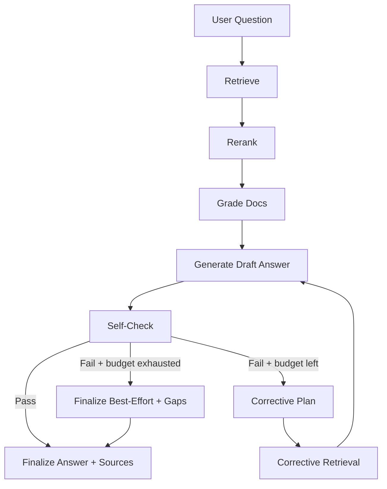

# Aegis: Self-Correcting RAG Advisor

Aegis is a production-grade Retrieval-Augmented Generation (RAG) agent that combines Self-RAG and Corrective-RAG. It retrieves documents, generates a grounded answer with citations, self-critiques grounding and citation coverage, and runs corrective retrieval loops until quality gates pass or the iteration budget is exhausted.

## What Aegis Does
- Retrieves and reranks document chunks from the selected libraries/corpus.
- Optionally grades document relevance to keep the best evidence.
- Generates a structured answer with inline citations and explicit sources.
- Runs a self-check on grounding, completeness, and citation coverage.
- If needed, issues targeted corrective queries and regenerates the answer.

## Configuration Knobs
Key tuning fields (see `Aegis.tuning` in `aegis_rag_expert.py`):
- `rag.top_k`: Retrieval breadth (default 35)
- `rag.top_r`: Rerank size (default 8)
- `rag.max_iterations`: Corrective loop budget (default 2)
- `rag.min_score`: Semantic score filter (default 0.0, disabled)
- `quality.min_docs`: Minimum documents required before finalizing (default 3)
- `output.include_sources_section`: Include the Sources section (default true)
- `output.include_inferred_recos`: Allow inferred recommendations (default true; auto-disabled in corpus-only mode)

## Flow (Mermaid)

