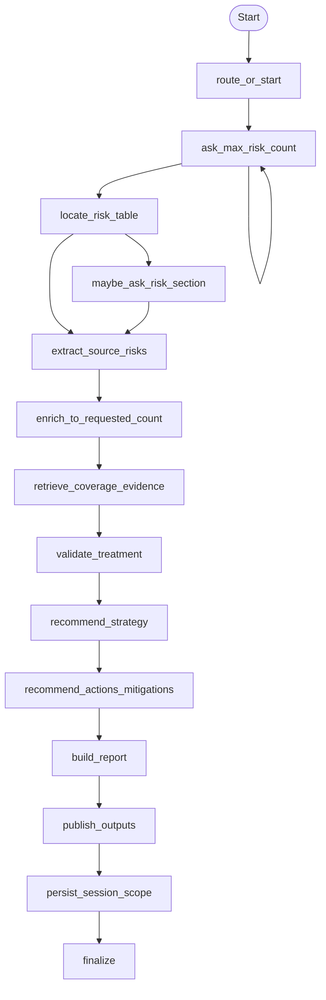
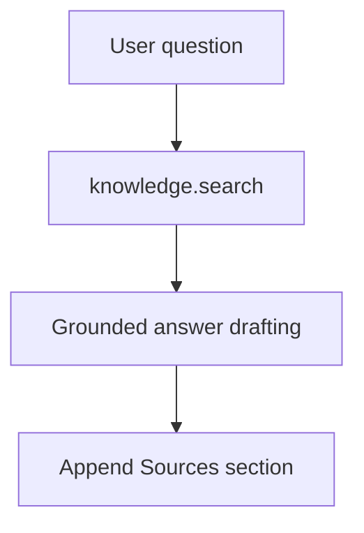

# DVA Risk Validator Assistant v2.1

This package provides two standalone candidate V2 agents:

- `DVARiskValidatorGraph` (`candidate.dva_risk_validator.graph.v2_1`)
- `DVARiskValidatorQA` (`candidate.dva_risk_validator.qa.v2_1`)

Both definitions expose chat options with `default=True` for:

- `chat_options.attach_files`
- `chat_options.libraries_selection`
- `chat_options.documents_selection`
- `chat_options.search_rag_scoping`

## Graph Agent

`DVARiskValidatorGraph` validates DVA risk treatment evidence, enforces blocker
rules, produces inferred recommendations, and publishes:

- `result.md`
- `risk_index.json`

## QA Agent

`DVARiskValidatorQA` is a dedicated standalone ReAct definition for grounded
follow-up questions over:

- original DVA context
- generated graph report
- generated risk index

## Session Scope Merge

Graph completion uses `merge_session_scope(...)` to preserve existing selected
libraries/documents and append generated artifact `document_uid` values while
setting `include_session_scope=True`.
