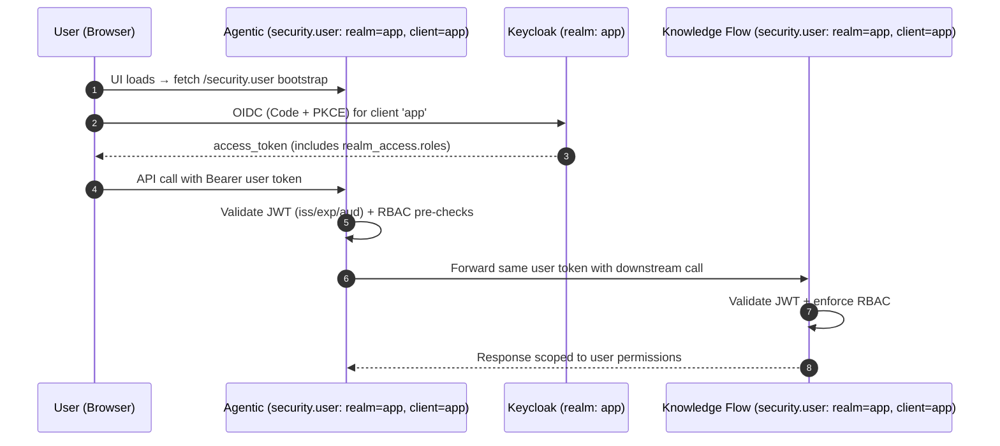
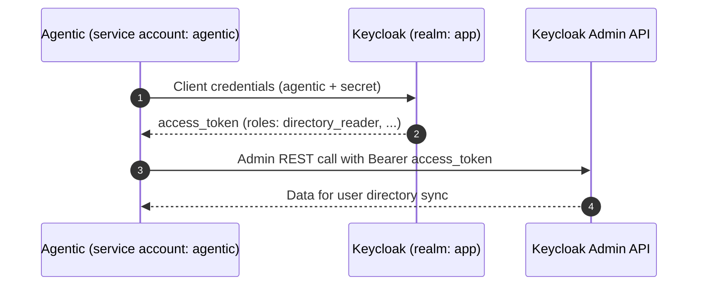

# Keycloak Integration — User Identity Forwarding
(Fred: Agentic ↔ Knowledge Flow)

This guide explains how to configure Keycloak so every request processed by the Agentic backend — including calls into Knowledge Flow — carries the authenticated **user’s** identity. Agent actions are now audited as user actions. The Agentic service account remains available for administrative jobs such as enumerating known users, but it is not used for runtime calls between backends.

> Enforcement today
> - Signature / expiry / issuer: **enforced** in backends
> - Roles (RBAC): **enforced in Knowledge Flow** (`@authorize(...)` + `RBACProvider`)
> - Audience (`aud`): supported; recommended strict in production

---

## 1) Keycloak Setup

Perform these steps in every environment.

### 1.1 Realm
- Create a realm such as **`app`** so your endpoints resolve to `.../realms/app`.

### 1.2 Clients
Create (or verify) the clients below:

| Client ID         | Type           | Service Account | Used by | Purpose |
|---                |---             |---              |---      |---|
| `app`             | Public (SPA + PKCE) or Confidential | **OFF** | **UI** | Interactive user login. The UI fetches bootstrap data from Agentic’s `security.user`. |
| `agentic`         | **Confidential** | **ON** | **Agentic backend** | Provides a service identity for background administration (e.g. querying Keycloak for known users). **Not used for runtime API calls.** |
| `knowledge-flow`  | **Confidential** | ON | **Knowledge Flow backend** | Optional outbound identity when Knowledge Flow calls third-party services. Keep enabled if you plan to expand integrations. |

> Secrets to store:
> - `agentic` → `KEYCLOAK_AGENTIC_CLIENT_SECRET`
> - `knowledge-flow` → `KEYCLOAK_KNOWLEDGE_FLOW_CLIENT_SECRET` (only required when Knowledge Flow calls other services)

When ReBAC is enabled: grant the `knowledge-flow` and `agentic` service account the ability to read users/groups so it can resolve relationships:
- Client roles on `realm-management`: `query-users`, `query-groups`, `view-users`
- Client role on `account`: `view-groups`

Additionaly `knowledge-flow` need to be able to remove/add users in groups, grant it:
- Client roles on `realm-management`: `manage-users`

### 1.3 Roles for user RBAC
Create **client roles on `app`** (not realm roles) so Knowledge Flow receives them in `realm_access.roles`:

| Role    | Assigned To             | Grants in Knowledge Flow (`RBACProvider`) |
|---      |---                      |---|
| `admin` | Admin users             | All actions on all resources |
| `editor`| Power users / curators  | CRUD on most Knowledge Flow resources + selected Agentic actions |
| `viewer`| Standard users          | Read access to most resources; can chat and upload attachments |

> Optional: define a dedicated role (e.g. `directory_reader`) for the Agentic service account if you intend to call Keycloak admin APIs. Grant only what those tasks require.

### 1.4 Groups (recommended)
- Create groups `admins`, `editors`, `viewers` and map each group to the matching role.
- Add users to groups so the UI tokens automatically include the correct client roles and now emit group paths in the JWT.

### 1.5 Client scopes
- `roles` scope must appear under **Default client scopes** for `app`, `agentic`, and any other confidential client that should receive role claims.

When ReBAC is enabled:

- Add a dedicated client scope (e.g., `groups-scope`) that maps the user’s group membership into the token:
  - Protocol mapper: `oidc-group-membership-mapper`
  - Config: `claim.name=groups`, `full.path=true`, `access.token.claim=true`, `userinfo.token.claim=true`, `id.token.claim=true`, `multivalued=true`
- Attach `groups-scope` to **Default client scopes** for `app` so tokens include the `groups` claim.

### 1.6 Audience (strict mode)
- When enforcing audience checks, add an **Audience** mapper so tokens destined for Knowledge Flow include `knowledge-flow` in `aud`.

---

## 2) Backend Configuration

Both backends validate the same user tokens. `security.user` is therefore identical, while `security.m2m` remains available for service-account automation.

### 2.1 Agentic `configuration.yaml`
```yaml
app:
  name: "Agentic Backend"
  base_url: "/agentic/v1"
  address: "127.0.0.1"
  port: 8000
  log_level: "info"
  reload: false
  reload_dir: "."

security:
  # Service account kept for background jobs (e.g., Keycloak user sync); not used for runtime API calls.
  m2m:
    enabled: true
    client_id: "agentic"
    realm_url: "http://app-keycloak:8080/realms/app"

  # User bootstrap consumed by the UI and by Agentic when forwarding user tokens.
  user:
    enabled: true
    client_id: "app"
    realm_url: "http://app-keycloak:8080/realms/app"

  authorized_origins:
    - "http://localhost:5173"
```

Environment variable:
```
KEYCLOAK_AGENTIC_CLIENT_SECRET=<secret of client 'agentic'>
```

### 2.2 Knowledge Flow `configuration.yaml`
```yaml
app:
  name: "Knowledge Flow Backend"
  base_url: "/knowledge-flow/v1"
  address: "127.0.0.1"
  port: 8111
  log_level: "info"
  reload: false
  reload_dir: "."

security:
  # Optional identity for outbound calls from Knowledge Flow.
  m2m:
    enabled: true
    client_id: "knowledge-flow"
    realm_url: "http://app-keycloak:8080/realms/app"

  # Shared realm/client with the UI to validate forwarded user tokens.
  user:
    enabled: true
    client_id: "app"
    realm_url: "http://app-keycloak:8080/realms/app"

  authorized_origins:
    - "http://localhost:5173"
```

Environment variable (only if outbound calls are required):
```
KEYCLOAK_KNOWLEDGE_FLOW_CLIENT_SECRET=<secret of client 'knowledge-flow'>
```

### 2.3 Recommended hardening flags
```
FRED_STRICT_ISSUER=true
FRED_STRICT_AUDIENCE=true   # enable after configuring the Audience mapper
FRED_JWT_CLOCK_SKEW=0
FRED_AUTH_VERBOSE=false
```

### 2.4 Whitelist (optional, file-based)
You can restrict access to **only** users whose email is listed in a file.

**Activation rules**
- `users.txt` **absent** → whitelist **disabled**
- `users.txt` present but **empty / comments only (# at the beginning of the line)** → whitelist **disabled**
- `users.txt` present and **non-empty** → whitelist **enabled**
- `users.txt` present but **unreadable** → whitelist **disabled** (logged)

**Format**
- One email per line
- Blank lines allowed
- Lines starting with `#` are comments and ignored
- Emails are normalized with `strip().lower()`

**Example**
```
# Allowed users
alice@app.com
simon.cariou@thalesgroup.com
```

**Kubernetes (Helm chart)**
Use the file-based ConfigMap shipped in the chart:

1) Put the whitelist in the chart:
```
deploy/charts/fred/files/whitelist/users.txt
```

2) Enable the whitelist in `values.yaml`:
```yaml
global:
  whitelist:
    enabled: true
    filePath: "files/whitelist/users.txt"
    # Optional: custom file location inside the chart
    # filePath: "contrib/whitelist/users.txt"
    # Optional: inline content (useful with --set-file)
    # user_list_inline: |
    #   alice@app.com
    #   bob@app.com
```

3) The ConfigMap is mounted into both backends at:
```
/fred-core/fred_core/security/whitelist_access_control/users.txt
```

**Dev (no k8s)**
Edit the local file directly:
```
fred-core/fred_core/security/whitelist_access_control/users.txt
```

**Installing from a `.tgz` without chart changes**
You can inject the file content at install time:
```bash
helm upgrade --install fred ./fred-<version>.tgz \
  --set global.whitelist.enabled=true \
  --set-file global.whitelist.user_list_inline=/path/to/users.txt
```

**Behavior**
- When enabled, non-whitelisted users receive `HTTP 403` with `detail="user_not_whitelisted"`.
- The UI redirects those users to `/coming-soon`.

---

## 3) Runtime Flow — User Identity Forwarding
- UI boots, fetches Agentic’s `security.user`, and launches the PKCE flow against realm `app`, client `app`.
- User obtains an access token that carries `realm_access.roles`.
- UI calls Agentic with that Bearer token.
- Agentic validates the JWT, enforces any local checks, and forwards the **same** token when invoking Knowledge Flow or other downstream services.
- Knowledge Flow validates the forwarded token, checks RBAC via `@authorize(...)`, and executes the request as the originating user.
- Any actions performed by agents are now logged and audited as end-user activity.

---

## 4) Verify End-to-End

1. Authenticate as a user (via the UI or CLI helper) to obtain an access token for client `app`.
   ```bash
   KC="http://app-keycloak:8080/realms/app/protocol/openid-connect/token"
   TOKEN=$(curl -s -X POST "$KC" \
     -d grant_type=password \
     -d client_id=app \
     -d username="<user>" \
     -d password="<password>" \
     | jq -r .access_token)
   ```
   (Use the UI for production flows; `password` grant is only for local verification.)

2. Call Agentic with the user token:
   ```bash
   curl -H "Authorization: Bearer $TOKEN" \
        -H "Accept: application/json" \
        http://localhost:8000/agentic/v1/health
   ```

3. Trigger an Agentic action that calls Knowledge Flow and confirm the same token appears in Knowledge Flow logs (`user=<uid>` with the expected roles).

4. Optional: capture the forwarded request in Knowledge Flow and inspect the JWT payload.
   ```bash
   cut -d. -f2 <<<"$TOKEN" | base64 -d | jq .realm_access
   # Expect assigned roles, e.g. ["viewer", ...]
   ```

---

## 5) RBAC Reference

The `RBACProvider` defines permissions per role:
```python
"admin":  { resource: ALL for resource in Resource },
"editor": { ... },  # CRUD across Knowledge Flow resources
"viewer": { ... },  # Read-only defaults + chat, attachments, prompts
```
Endpoints declare requirements:
```python
@authorize(Action.READ, Resource.DOCUMENTS)
def similarity_search_with_score(..., user: KeycloakUser, ...):
    ...
```
If a role is missing you will see:
```
Authorization denied: user=<uid> roles=<[]> action=read resource=documents
```

---

## 6) Service Account Operations (Optional)

Keep the `agentic` service account ready for background maintenance jobs. When those jobs run, mint a token with client credentials and call the Keycloak Admin API.
```bash
KC="http://app-keycloak:8080/realms/app/protocol/openid-connect/token"
SERVICE_TOKEN=$(curl -s -X POST "$KC" \
  -d grant_type=client_credentials \
  -d client_id=agentic \
  -d client_secret="$KEYCLOAK_AGENTIC_CLIENT_SECRET" | jq -r .access_token)

# Example: list users (requires the appropriate client role)
curl -H "Authorization: Bearer $SERVICE_TOKEN" \
     "http://app-keycloak:8080/admin/realms/app/users"
```

Assign only the minimal roles required for these administrative calls.

---

## 7) Troubleshooting
- **Forwarded call rejected (401/403)** → Verify the user token is passed unchanged from Agentic to Knowledge Flow and that both backends trust the same realm URL.
- **`roles=[]` in tokens** → Ensure roles are defined as client roles on `app`, the `roles` client scope is attached, and the user belongs to the correct group.
- **`aud` mismatch** → Configure the Audience mapper and enable `FRED_STRICT_AUDIENCE=true`.
- **CORS issues** → Add the UI origin to `security.authorized_origins` in both backends.
- **Service account admin call fails** → Grant the background role (e.g. `directory_reader`) to the `agentic` service account and confirm the token contains it.

---

## 8) Diagrams

### 8.1 User Login & Forwarded Calls


### 8.2 Service Account Maintenance (Optional)

